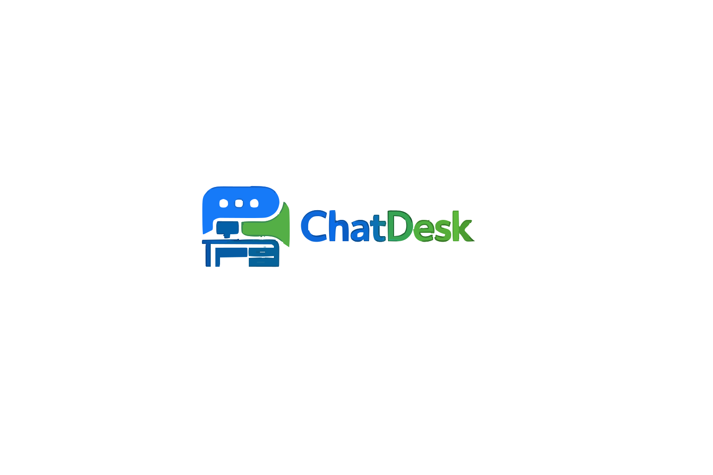
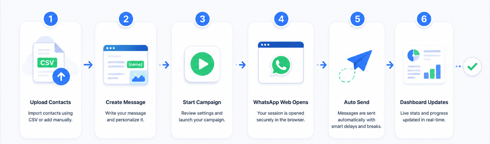
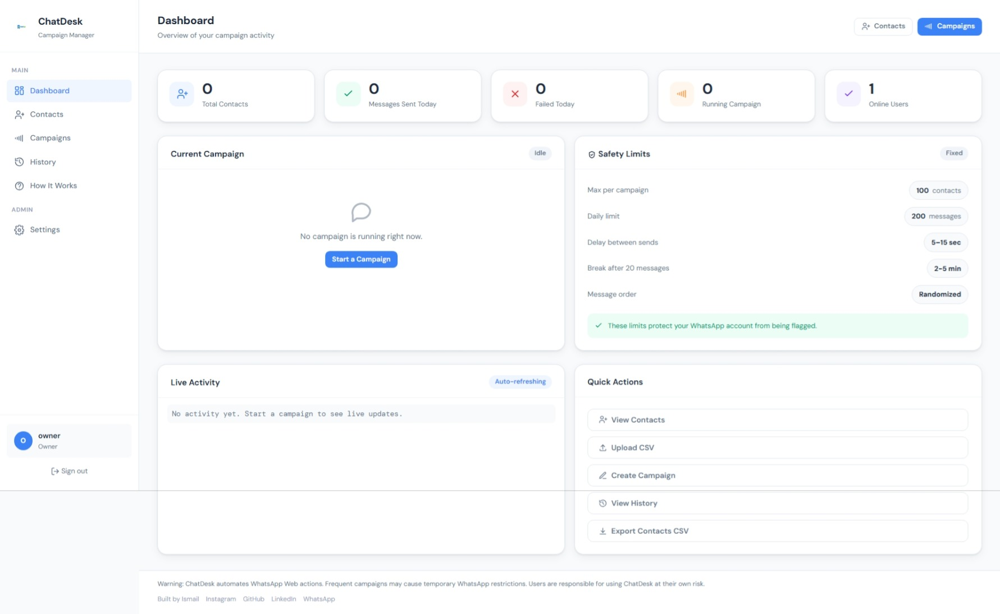
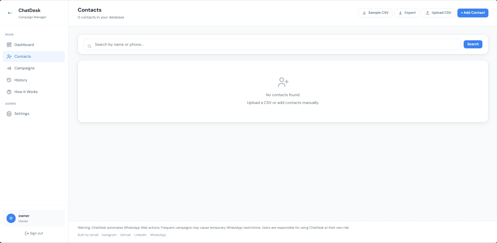
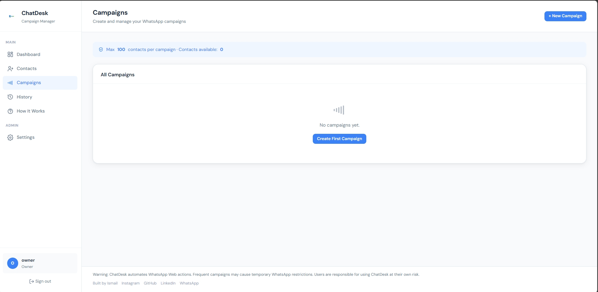
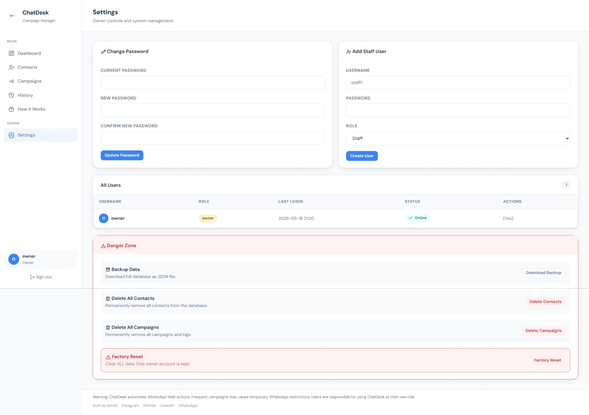
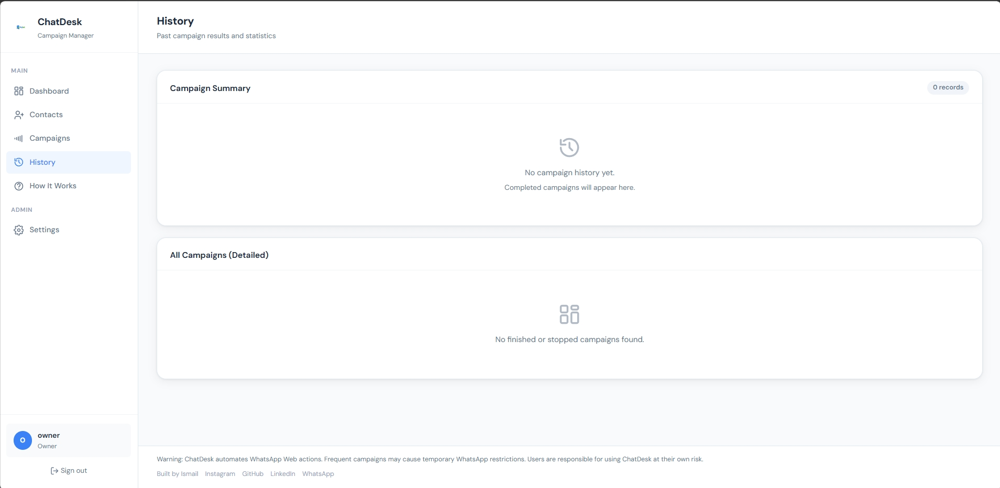
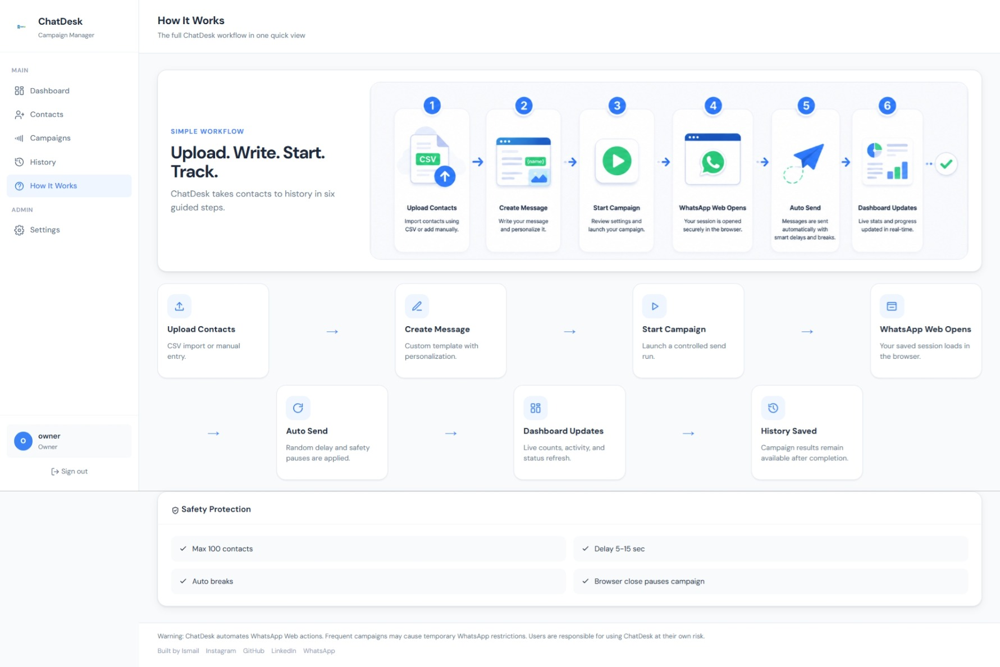

# 

# ChatDesk

Safe local WhatsApp campaign management for teams.




## About

ChatDesk is a local-network WhatsApp campaign CRM built for small businesses, schools, and tuition centres that need a safer and more organized way to manage outreach.

Managing 100+ WhatsApp contacts manually is slow, repetitive, and difficult to track. ChatDesk helps teams upload contacts, create campaign messages, monitor delivery progress, review history, and manage staff access from a shared local dashboard. It keeps the workflow simple while adding safeguards such as limits, pause controls, recovery logic, and session handling.

## Features

- [x] Contact management
- [x] CSV upload
- [x] Campaign creation
- [x] Dashboard
- [x] History
- [x] Local network access
- [x] Staff login
- [x] Safety limits
- [x] Auto pause
- [x] Session recovery

## Workflow

```text
Upload Contacts
↓
Create Message
↓
Start Campaign
↓
WhatsApp Web
↓
Auto Send
↓
Dashboard Updates
↓
History Saved
```

## Screenshots

### Dashboard


### Contacts


### Campaigns


### Settings


### History


### How It Works


## Tech Stack

**Frontend**

- HTML
- CSS
- JavaScript

**Backend**

- Flask

**Database**

- SQLite

**Automation**

- Playwright

## Installation

```bash
git clone https://github.com/ismailkkaaa/ChatDesk.git
cd ChatDesk
pip install -r requirements.txt
python app.py
```

## Local Network Usage

Once the server starts, open ChatDesk on your local machine or share it across the same WiFi or local network.

Example:

```text
http://192.168.x.x:5000
```

Staff members connected to the same network can log in using that address from their own devices.

## Safety Notice

ChatDesk automates WhatsApp Web actions.

Frequent campaigns, aggressive sending patterns, or unsafe usage may increase the risk of temporary WhatsApp restrictions.

Use sensible limits, monitor campaign activity carefully, and use ChatDesk at your own risk.

## Project Structure

```text
ChatDesk/
├── templates/
├── static/
├── uploads/
├── exports/
├── database.db
├── app.py
├── requirements.txt
└── README.md
```

## Developer

Built with ❤️ by Ismail

- [Instagram](https://www.instagram.com/ismail_.7x)
- [GitHub](https://github.com/ismailkkaaa)
- [LinkedIn](https://www.linkedin.com/in/albasithismail7x)
- [WhatsApp](https://wa.me/message/ZAXXTKBRHVTOI1)

## License

This project is shared for personal and educational use. It is not intended as a production-grade bulk messaging platform, and users are responsible for complying with platform rules, privacy obligations, and local regulations before using it.

## Footer

Thanks for checking out ChatDesk.
